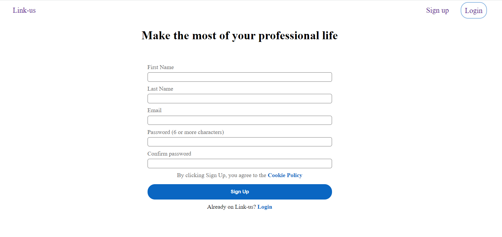
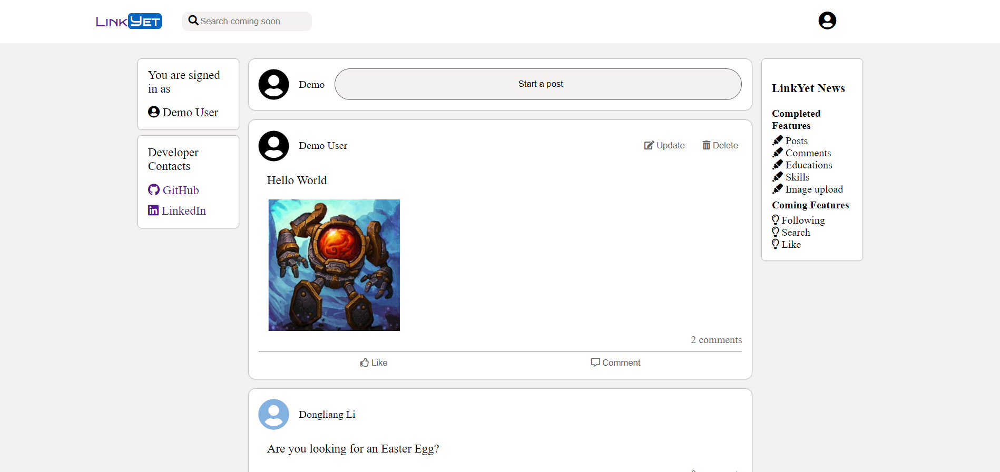
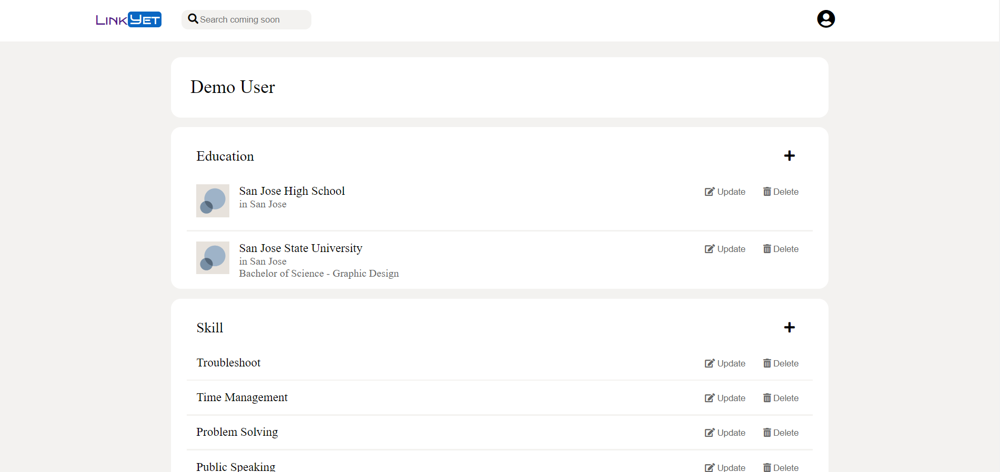

# Introdution
This website is a clone of LinkedIn. You can view all posts and comments after login.
You can create/update/delete posts and comments that belong to you.

# Technology

- React - An frontend library for building user interfaces.
- Redux - A predictable, centralized state container for JavaScript apps.
- Python - A programming language for building backend data manipulation.
- SQLAlchemy - A library that facilitates the communication between Python programs and databases
- Database: Development: SQLite3

# Screenshot of Project




# Set up
1. Clone this repository

2. Install dependencies for backend

      ```bash
      pipenv install -r requirements.txt
      ```

3. Create a **.env** file based on the example with proper settings for your
   development environment

4. Make sure the SQLite3 database connection URL is in the **.env** file

5. For `SCHEMA`, making sure you use the snake_case convention.
   For `SECRET_KEY`, put in your own serect key.

6. With pipenv, migrate your database, seed your database, and run your Flask app

   ```bash
   pipenv run flask db upgrade
   ```

   ```bash
   pipenv run flask seed all
   ```

   ```bash
   pipenv run flask run
   ```
7. In another terminal, cd into the ```react-app``` directory and install dependencies for React frontend

      ```bash
      npm install
      ```
8. Once all the installation for dependencies is completed, start the application
      ```bash
      npm start
      ```

# Features

### Post
* Users can create/read/update/delete post. Optional image upload when creating the post.
### Comment
* Users can comment on their own post or other people's post.
### Education
* Under profile page, users can add their educations (for example, high school, college) with school and city, optional degree and major.
### SKill
* Under profile page, users can add their skills. A general suggestion box is also provided.
### AWS Image Upload
* Only implement to post at the moment.
### Easter Eggs
* Who doesn't like an Easter egg hunt?

# Redux Implement Decision
* Reducer only have a case of setAll (example: setAllPosts, setAllComments) and default
* Other thunk dispatch actions (such as, update and delete) will call the thunk set/fetch dispatch action after getting good response
* I make this decision because contents of website is constantly changing when multiply users creating/deleting posts/comments. Constantly fetching latest acitivties from other users seems like more logical approach.
